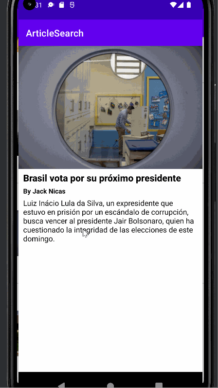

## Android Article Search App
The Android Article Search App uses the New York Times Article Search API to create an android mobile application that shows the current articles as well as the full contents of the article using recycler views and intent objects.

